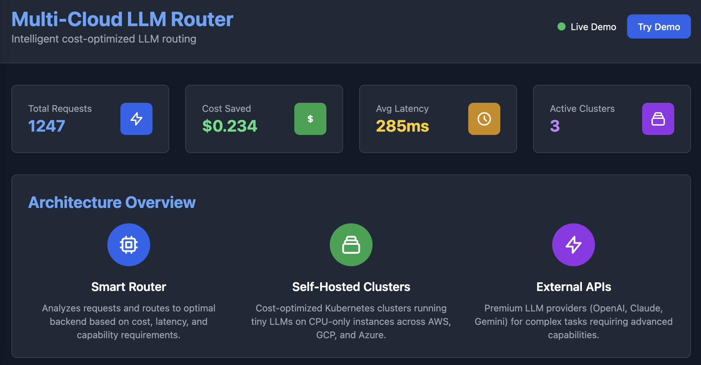
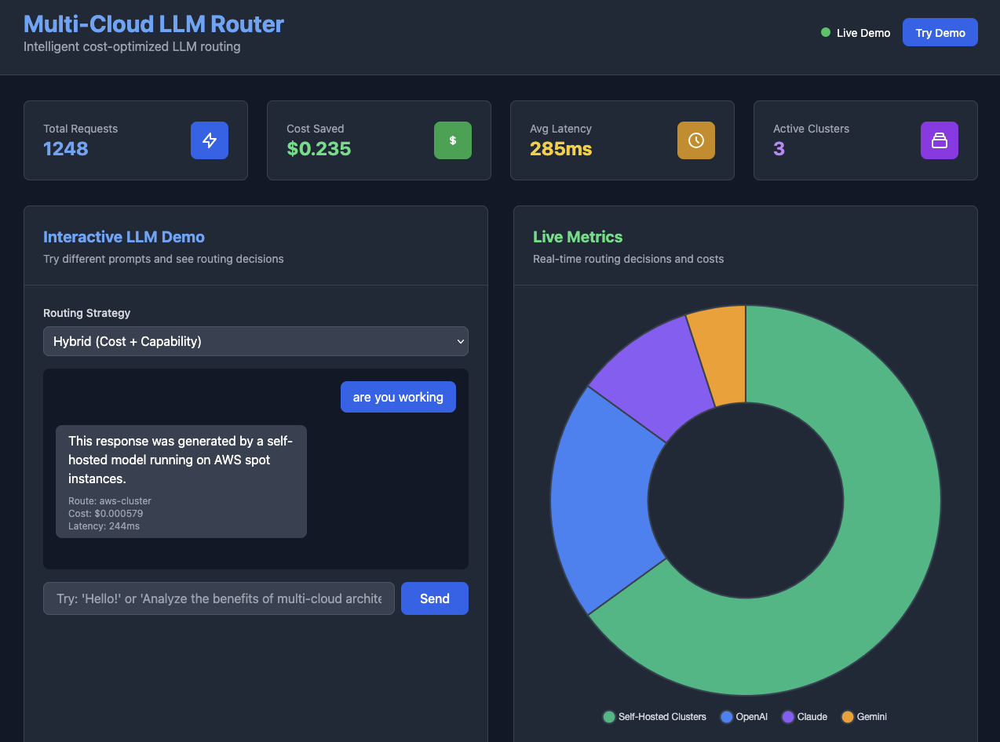
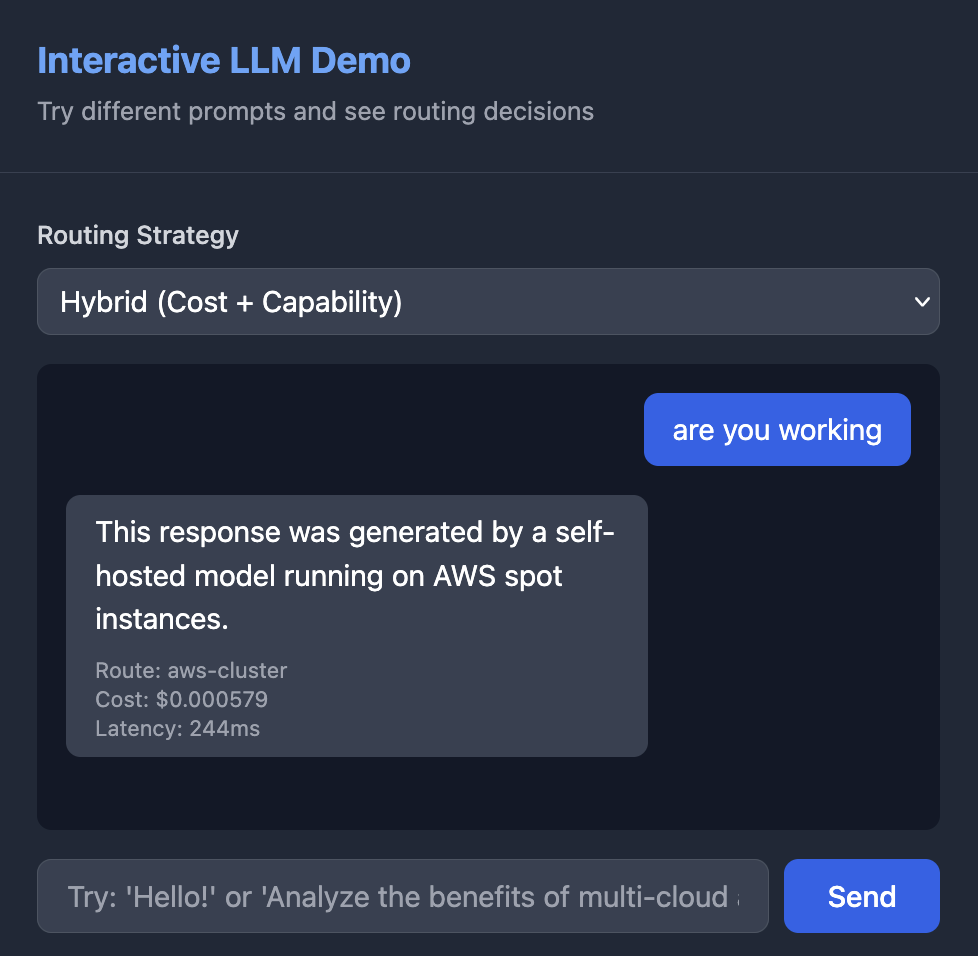

# Multi-Cloud LLM Router

A cost-optimized, latency-aware router that intelligently distributes LLM requests across self-hosted clusters and external providers (OpenAI, Claude, Gemini). Automatically routes between external premium APIS and CPU-only llama.cpp servers running on Kubernetes in AWS, GCP, and Azure based on cost, latency, and capability requirements.

## 🎪 **Live Demo**

**Try it now:** [https://mini.multicloud.navillasa.dev](https://mini.multicloud.navillasa.dev)  
**Password:** `demo123`

### What You'll See:
This demo showcases the **high-level routing architecture and algorithms** with controlled costs:
- **Interactive LLM Playground** - Test different prompts and see routing decisions in real-time
- **Smart mocking** due to expensive operations (external API calls, full cluster deployments)
- **Routing Logic** - Simple prompts route to "cost-optimized clusters", complex ones to "external APIs"  
- **Metrics Dashboard** - Cost calculations, routing decisions, and savings
- **Professional Architecture** - SSL, monitoring, containerized microservices
- **A very cost-effective demo** (~$10/month vs $200+/month for full multi-cloud)



*For guide to production deployment with k8s, see [DEPLOYMENT_GUIDE.md](DEPLOYMENT_GUIDE.md)*

## 🌍 Key Features

- **Hybrid Architecture**: Routes between self-hosted clusters (AWS/GCP/Azure) and external LLM APIs
- **Cost-Aware Routing**: Real-time $/1K token calculations with configurable thresholds
- **Multi-Cloud Redundancy**: Deploys across AWS EKS, GCP GKE, and Azure AKS
- **External Provider Support**: OpenAI, Anthropic Claude, Google Gemini integration
- **Intelligent Fallback**: Automatic failover between self-hosted and external providers
- **Comprehensive Monitoring**: Prometheus metrics for cost, latency, and routing decisions
- **Auto-Scaling**: HPA based on CPU utilization and queue depth
- **Secure Authentication**: HMAC and mTLS support for cluster communication
- **Multiple Routing Strategies**: Cost, latency, hybrid, and capability-based routing

## Architecture

### Hybrid Routing Architecture
```
[Client Request] 
    ↓
[Smart Router] ← Cost Analysis + Health Checks
    ↓
┌─────────────┬─────────────────┐
│ Self-Hosted │ External APIs   │
│ Clusters    │ (OpenAI/Claude) │
└─────────────┴─────────────────┘
    ↓              ↓
 [LLMs]         [LLMs]
```

### Multi-Cloud Infrastructure
```
[Client] ──HTTPS──> [Global Router]
                         │
          ┌──────────────┼────────────────┐
          │              │                │
   HTTPS/mTLS      HTTPS/mTLS       HTTPS/mTLS
          │              │                │
    AWS EKS (CPU)    GCP GKE (CPU)    Azure AKS (CPU)
      │                │                  │
[llama.cpp pods] [llama.cpp pods] [llama.cpp pods]
  (gguf models)    (gguf models)     (gguf models)
      │                │                  │
[Prom + Exporter][Prom + Exporter][Prom + Exporter]
      └───────────────metrics + costs─────────────┘
                         ↓
                 [Router cost engine]
```

## 🎯 Routing Strategies



### 1. Hybrid (Recommended)
- **Cheap requests** (< $0.01/1K tokens): Route to self-hosted clusters
- **Expensive requests**: Route to cheapest external provider
- **Fallback**: External providers when clusters are unhealthy

### 2. Cost-First
- Always routes to the absolute cheapest option available
- Considers real-time cluster performance and external API pricing

### 3. Cluster-First
- Prefer self-hosted clusters for cost control
- Fallback to external providers when clusters are down/overloaded

### 4. External-First
- Prefer external providers for reliability
- Fallback to self-hosted for cost savings

### 5. Latency-First
- Route to lowest latency option (usually self-hosted)

## 💡 Provider Capabilities

| Provider | Best For | Cost Range | Context Window |
|----------|----------|------------|----------------|
| **Your Clusters** | Simple tasks, cost control | $0.001-0.01/1K | 2K-8K tokens |
| **OpenAI GPT-3.5** | General purpose | $0.0005-0.0015/1K | 16K tokens |
| **Claude Haiku** | Fast responses | $0.00025-0.00125/1K | 200K tokens |
| **Gemini Flash** | Large context | $0.000075-0.0003/1K | 1M tokens |
| **GPT-4 Turbo** | Complex reasoning | $0.01-0.03/1K | 128K tokens |
| **Claude Sonnet** | Analysis tasks | $0.003-0.015/1K | 200K tokens |

## 🚀 Quick Start

### Prerequisites

- Go 1.21+
- Pulumi CLI (for infrastructure deployment)
- kubectl
- Helm 3.x
- Cloud provider CLIs (aws, gcloud, az)
- External LLM API keys (optional)

### 1. Setup Environment

```bash
# Clone and setup
git clone <your-repo>
cd multi-cloud-llm-router
./scripts/setup.sh

# Set up API keys for external providers (optional)
export OPENAI_API_KEY="sk-..."
export ANTHROPIC_API_KEY="sk-ant-..."
export GEMINI_API_KEY="..."
```

### 2. Configure Router

```bash
# Copy example configuration
cp router/config-example.yaml router/config.yaml

# Edit configuration for your setup
vim router/config.yaml
```

### 3. Deploy Infrastructure (Production)

```bash
# Deploy to AWS
cd infra/aws
pulumi up

# Deploy to GCP
cd ../gcp  
pulumi up

# Deploy to Azure
cd ../azure
pulumi up
```

### 4. Start Router

```bash
cd router

# For local development
go run main.go --config config.yaml

# Or build and run
go build -o router .
./router --config config.yaml
```

### 5. Test Hybrid Routing

```bash
# Test simple request (should route to cluster)
curl -X POST http://localhost:8080/v1/chat/completions \
  -H "Content-Type: application/json" \
  -d '{"model":"gpt-3.5-turbo","messages":[{"role":"user","content":"Hi"}],"max_tokens":10}'

# Test complex request (may route to external)  
curl -X POST http://localhost:8080/v1/chat/completions \
  -H "Content-Type: application/json" \
  -d '{"model":"gpt-4","messages":[{"role":"user","content":"Write a detailed analysis of..."}],"max_tokens":2000}'

# Run comprehensive test
./scripts/test-hybrid-routing.sh
```

## ⚙️ Configuration

### Basic Hybrid Configuration

```yaml
server:
  port: 8080
  readTimeout: 30s
  writeTimeout: 120s

router:
  routingStrategy: hybrid              # hybrid, cost, latency, cluster_first, external_first
  clusterCostThreshold: 0.01          # Use clusters for requests under $0.01/1K tokens
  enableExternalFallback: true        # Fallback to external when clusters fail
  healthCheckInterval: 30s
  maxLatencyMs: 5000
  maxQueueDepth: 10

# Self-hosted clusters
clusters:
  - name: aws-us-west-2
    endpoint: https://aws.llm.yourdomain.com
    region: us-west-2
    provider: aws
    costPerHour: 0.0928
    authType: hmac
    sharedSecret: your-shared-secret

# External providers
externalProviders:
  - name: openai
    type: openai
    enabled: true
    apiKey: "${OPENAI_API_KEY}"
    defaultModel: gpt-3.5-turbo
    
  - name: claude
    type: claude
    enabled: true
    apiKey: "${ANTHROPIC_API_KEY}"
    defaultModel: claude-3-haiku-20240307
    
  - name: gemini
    type: gemini
    enabled: true
    apiKey: "${GEMINI_API_KEY}"
    defaultModel: gemini-1.5-flash
```

### Configuration Examples

**Cost-Optimized Setup**:
```yaml
router:
  routingStrategy: hybrid
  clusterCostThreshold: 0.01
externalProviders:
  - name: claude
    defaultModel: claude-3-haiku-20240307  # Cheapest Claude
  - name: gemini  
    defaultModel: gemini-1.5-flash         # Cheapest Google
```

**Performance-Optimized Setup**:
```yaml
router:
  routingStrategy: cluster_first
  maxLatencyMs: 2000
externalProviders:
  - name: openai
    defaultModel: gpt-3.5-turbo  # Fast and reliable
```

**Capability-Optimized Setup**:
```yaml
router:
  routingStrategy: external_first
externalProviders:
  - name: claude-premium
    defaultModel: claude-3-5-sonnet-20241022
  - name: openai-premium  
    defaultModel: gpt-4-turbo
```

## 📊 Monitoring & Metrics

### Health Check

```bash
curl http://localhost:8080/health
```

**Response:**
```json
{
  "status": "healthy",
  "healthy_clusters": 2,
  "total_clusters": 3,
  "healthy_providers": 3,
  "total_providers": 3,
  "timestamp": "2024-01-15T10:30:00Z"
}
```

### Prometheus Metrics

Key metrics exposed at `/metrics`:

```
# Routing decisions
llm_router_routing_decisions_total{target="aws-us-west-2",type="cluster",reason="hybrid_cluster"}

# Provider health
llm_router_provider_health{provider="openai",type="external"}
llm_router_cluster_health{cluster="aws-us-west-2",provider="aws",region="us-west-2"}

# Cost tracking
llm_router_provider_cost_per_1k_tokens{provider="claude",model="claude-3-haiku"}
llm_router_cluster_cost_per_1k_tokens{cluster="gcp-us-central1",provider="gcp"}

# Request metrics
llm_router_requests_total{target="openai",status="success"}
llm_router_request_duration_seconds{target="claude"}

# Token usage
llm_router_tokens_total{provider="gemini",type="input"}
llm_router_external_requests_total{provider="openai",model="gpt-3.5-turbo",status="success"}
```

## 🗂️ Directory Structure

```
├─ infra/                       # Infrastructure as Code (Pulumi)
│  ├─ aws/                      # EKS, VPC, nodegroup, ECR, IAM OIDC, DNS
│  ├─ gcp/                      # GKE, VPC, Artifact Registry, IAM, DNS
│  ├─ azure/                    # AKS, VNet, ACR, Managed Identity, DNS
│  └─ common/                   # Shared Go utilities (tags, naming, kubeconfig)
├─ clusters/                    # Argo CD "app-of-apps" per cluster
│  ├─ aws/overlays/prod/
│  ├─ gcp/overlays/prod/
│  └─ azure/overlays/prod/
├─ charts/                      # Helm charts
│  ├─ llm-server/               # llama.cpp + Service + Ingress + HPA + PVC
│  ├─ exporters/                # Cost+throughput exporter + ServiceMonitor
│  └─ platform/                 # ingress-nginx, cert-manager, kube-prometheus-stack
├─ router/                      # Global Router (Go application)
│  ├─ internal/cost/            # $/1K cost calculation engine
│  ├─ internal/health/          # Per-cluster health + queue polling
│  ├─ internal/forward/         # HMAC/mTLS signed forwarding
│  ├─ internal/providers/       # External LLM provider clients
│  ├─ config-example.yaml       # Example configuration
│  └─ main.go                   # Main application
├─ argocd/                      # Argo CD bootstrap manifests
├─ models/                      # Model metadata (names, URIs, quant levels)
└─ scripts/                     # Deployment and testing scripts
```

## 🔧 Development

### Local Development

```bash
# Run router locally
cd router
go run main.go --config config-dev.yaml

# Run tests
go test ./...

# Integration tests
go test -tags=integration ./tests/

# Load testing with k6
k6 run tests/load-test.js
```

### Docker Build

```bash
docker build -t llm-router .
docker run -p 8080:8080 -v $(pwd)/config.yaml:/config.yaml llm-router
```

### Testing with Local LLM

```bash
# Download a small model for testing
mkdir -p models
cd models
wget https://huggingface.co/TheBloke/TinyLlama-1.1B-Chat-v1.0-GGUF/resolve/main/tinyllama-1.1b-chat-v1.0.q4_k_m.gguf

# Run llama.cpp server (if installed)
llama-cpp-server --model tinyllama-1.1b-chat-v1.0.q4_k_m.gguf --port 8081 --host 0.0.0.0
```

## 🥽 Use Cases

### 1. Cost-Conscious Development
- **Route simple queries** (code completion, basic Q&A) → Your clusters
- **Route complex tasks** (analysis, reasoning) → External APIs
- **Estimated savings**: 60-80% on LLM costs

### 2. High Availability Service
- **Primary**: Your clusters for predictable costs
- **Fallback**: External providers for reliability
- **SLA**: 99.9% uptime with automatic failover

### 3. Geographic Distribution
- **Local regions**: Your clusters for low latency
- **Global users**: External providers for coverage
- **Optimization**: Route based on user location

### 4. Load Balancing
- **Normal load**: Your clusters handle baseline traffic
- **Peak load**: External providers absorb spikes
- **Auto-scaling**: Dynamic routing based on queue depth

## 🔐 Authentication

### Cluster Authentication
- **HMAC**: Shared secret with timestamp-based signatures
- **mTLS**: Mutual TLS certificates for enhanced security

### External Provider Authentication
- **API Keys**: Secure API key management with environment variables
- **Rate Limiting**: Configurable rate limits per provider

## 🛟 Troubleshooting

### Debug Mode

```bash
export LOG_LEVEL=debug
./router --config config.yaml
```

### Monitoring Routing Decisions

```bash
# Real-time routing decisions
curl http://localhost:8080/metrics | grep routing_decisions

# Provider health status
curl http://localhost:8080/metrics | grep provider_health

# Cost comparison
curl http://localhost:8080/metrics | grep cost_per_1k_tokens
```

## ✨ Benefits

**Cost Optimization**: Use cheap self-hosted for simple tasks, premium APIs for complex ones  
**High Availability**: Automatic failover between self-hosted and external providers  
**Capability Scaling**: Access to more powerful models when needed  
**Geographic Coverage**: External APIs handle regions without your clusters  
**Load Distribution**: External providers absorb traffic spikes  
**Vendor Diversification**: Reduce dependency on single LLM provider  
**Multi-Cloud Redundancy**: Deploy across AWS, GCP, and Azure  
**Real-Time Cost Tracking**: Monitor and optimize LLM spending  

## 🛣️ Roadmap

- [ ] Add request caching layer
- [ ] Implement circuit breaker pattern
- [ ] Add OpenTelemetry tracing
- [ ] Support for streaming responses
- [ ] Enhanced cost prediction models
- [ ] A/B testing capabilities
- [ ] Webhook support for routing decisions

---

## 📞 **Contact**

- 📧 **Email**: navillasa.dev@gmail.com
- 💼 **LinkedIn**: [linkedin.com/in/natalievillasana](https://www.linkedin.com/in/natalievillasana)
- 🌐 **Portfolio**: [navillasa.dev](https://navillasa.dev)
